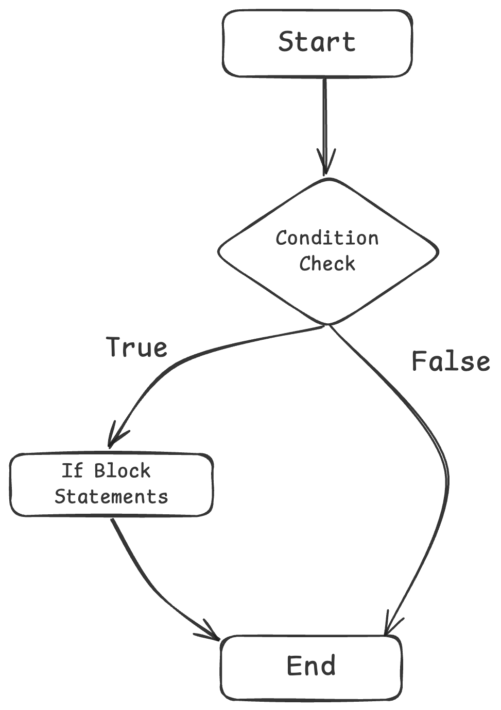

# Conditionals

Conditional constructs in programming languages allow us to make decision based on certain conditions. Usually every programming language has such kind of constructs using `if...else` keywords. These usually take a logical statement and based on whether it returns `true` or `false`, one of the blocks get executed.

## Overview

This lesson talks about conditional statements using simple `if` construct followed by `if..else` blocks. We will also take a look at *nested if* statements and multiple conditions using `if..else if..else` constructs.

The general syntax for `if...else` looks like this.

```go
if conditional {
    // statements
} else if condition2 {
    // statements
} else {
    // else statements
}
```

## If Statements

Let's first look at flow chart for `if` block.



In this case, we check the condition and if this condition evaluates to `true`, the `if` block gets executed. If the condition evaluates to `false`, the `else` block statements get executed.

```go
package main

import "fmt"

func main() {
	num := 10
	if num > 10 {
		fmt.Println(num)
	}
	fmt.Println("Ending the loop")
}
```

**Output**

```output{ lineNos=false }
Ending the loop
```

If you modify the `num` variable with a value of `20`. It returns below result.

```output{ lineNos=false }
20
Ending the loop
```

## If...Else Statements

Below is a flow chart for `if...else` statements in Go. In this case, if conditional check returns `true`, the if block gets executed otherwise else block gets executed.


Below code checks whether a person can drive or not depending on user's input.

```go
package main

import "fmt"

func main() {
	// Check whether a person is eligible to drive or not
	var age int
	fmt.Println("Enter you age: ")
	fmt.Scanf("%d", &age)
	if age > 18 {
		fmt.Println("Congratulations, you can drive")
	} else {
		fmt.Printf("You will have to wait %d years before you can drive.\n", 18-age)
	}
}
```

```shell{ .show-prompt lineNos=false }
go run main.go
Enter you age: 
32
```

```output{ lineNos=false }
Congratulations, you can drive
```

## If..Else If..Else Statements

This check is interesting. In this case, first it checks condition 1. If this returns `true` then first `if` block gets executed. If this returns `false`, then next we check for condition 2 in `else if` block. If this condition 2 returns `true`, `else if` block gets executed. If this also returns `false`, then we finally go to `else` block.


```go
package main

import "fmt"

func main() {
	grades := 75
	if grades > 80 {
		fmt.Println("You've passed with A+ grades")
	} else if grades > 70 {
		fmt.Println("You've passed with A grades")
	} else if grades > 55 {
		fmt.Println("You've passed with B grades.")
	} else if grades > 35 {
		fmt.Println("You've passed with C grades.")
	} else {
		fmt.Println("Unfortunately, you've failed.")
	}
}
```

```output{ lineNos=false }
You've passed with A grades.
```

In this case, the sequence of conditionals matter. Whichever condition from top to bottom first becomes `true`, that block will be executed. Also, with this construct, it will executed only one of the blocks.

## Nested If..Else Statements

If we want to check multiple conditions, we can also include nested `if..else` blocks. This will verify multiple conditions depending on first condition check. In upcoming example, we first verify person's age. If he is qualified for driving, we also verify whether the person has a valid driving licence by asking for this information. Depending on answers, we provide the output.

```go
package main

import "fmt"

func main() {
	// Check if a person is eligible and whether he has the valid driving license.

	var age int
	var isDrivingLicenceValid string
	fmt.Println("Enter you age: ")
	fmt.Scanf("%d", &age)
	if age > 18 {
		fmt.Println("Do you have a valid driving licence? y/n")
		fmt.Scanf("%s", &isDrivingLicenceValid)
		if isDrivingLicenceValid == "y" || isDrivingLicenceValid == "yes" {
			fmt.Println("Congratulations, you can drive")
		} else {
			fmt.Println("Oh no, you need valid driving licence to drive.")
		}
	} else {
		fmt.Printf("You will have to wait %d years before you can drive.\n", 18-age)
	}
}
```

Below are outputs of two runs with different inputs.

```shell{ .show-prompt lineNos=false }
go run main.go
```
**Output**

```output{ lineNos=false }
Enter you age: 
23
Do you have a valid driving licence? y/n
y
Congratulations, you can drive
```

```output{ lineNos=false }
Enter you age: 
23
Do you have a valid driving licence? y/n
n
Oh no, you need valid driving licence to drive.
```

## Conclusion

In this lesson, you learned about different ways to write `if..else` statements in Go.